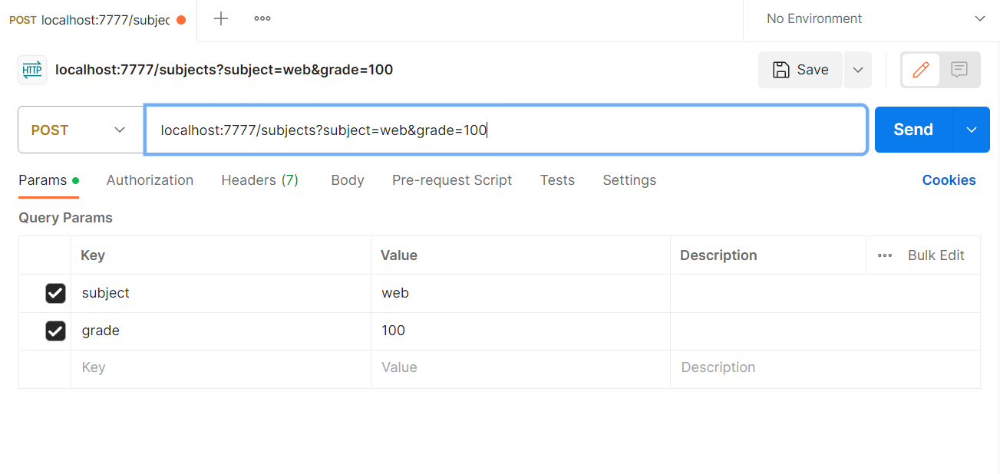

## Задание 5 
Необходимо написать простой web-сервер для обработки GET и POST http
запросов средствами Python и библиотеки socket. (PostMan)

### server.py
```python
import socket
from email.parser import Parser
from urllib.parse import parse_qs, urlparse

MAX_LINE = 64 * 1024
MAX_HEADERS = 100


class MyHTTPServer:

    def __init__(self, host, port):
        self.host = host
        self.port = port
        self.subjects = {}

    def inf_serve(self):
        s_sock = socket.socket(socket.AF_INET, socket.SOCK_STREAM)
        try:
            s_sock.bind((self.host, self.port))
            s_sock.listen()

            while True:
                conn, _ = s_sock.accept()
                self.cl_serve(conn)
        finally:
            s_sock.close()

    def cl_serve(self, conn):

        req = None 

        try:
            req = self.parse_req(conn)
            resp = self.handle_req(req)
            self.send_resp(conn, resp)

        except ConnectionResetError:
            conn = None

        except Exception as e:
            body = str(e).encode('utf-8')
            resp = Response(500, 'Internal Server Error', [('Content-Length', len(body))], body)
            self.send_resp(conn, resp)

        if conn:
            req.rfile.close()
            conn.close()


    def parse_req(self, conn):
        rfile = conn.makefile('rb')

        raw = rfile.readline(MAX_LINE + 1)
        if len(raw) > MAX_LINE:
            raise HTTPError(400, 'Bad request')

        req_l = str(raw, 'iso-8859-1')
        words = req_l.split()
        if len(words) != 3:
            raise HTTPError(400, 'Bad request')

        method, targ, ver = words
        if ver != 'HTTP/1.1':
            raise HTTPError(505, 'HTTP Version Not Supported')

        heads = self.parse_headers(rfile)
        host = heads.get('Host')
        if not host:
            raise HTTPError(400, 'Bad request')
        return Request(method, targ, ver, heads, rfile)


    def parse_headers(rfile):
        heads = []
        while True:
            line = rfile.readline(MAX_LINE + 1)
            if len(line) > MAX_LINE:
                raise HTTPError(494, 'Request header too large')

            if line in (b'\r\n', b'\n', b''):
                break

            heads.append(line)
            if len(heads) > MAX_HEADERS:
                raise HTTPError(494, 'Too many heads')

        sheaders = b''.join(heads).decode('iso-8859-1')
        return Parser().parsestr(sheaders)

    def handle_req(self, req):
        if req.path == '/subjects' and req.method == 'POST':
            return self.h_post_subjects(req)

        if req.path == '/subjects' and req.method == 'GET':
            return self.h_get_subjects()

        raise HTTPError(404, 'Not found')


    def send_resp(conn, resp):
        wfile = conn.makefile('wb')
        status_line = f'HTTP/1.1 {resp.status} {resp.reason}\r\n'
        wfile.write(status_line.encode('iso-8859-1'))

        if resp.heads:
            for (key, value) in resp.heads:
                header_line = f'{key}: {value}\r\n'
                wfile.write(header_line.encode('iso-8859-1'))

        wfile.write(b'\r\n')

        if resp.body:
            wfile.write(resp.body)

        wfile.flush()
        wfile.close()

    def h_post_subjects(self, req):
        subj_id = len(self.subjects) + 1
        self.subjects[subj_id] = {'id': subj_id,
                                        'subject': req.query['subject'][0],
                                        'grade': req.query['grade'][0]}
        return Response(204, 'Created')

    def h_get_subjects(self):
        content_type = 'text/html; charset=utf-8'
        body = '<html><head></head><body>'
        body += f'<div>Предметов - {len(self.subjects)}</div>'
        body += '<ul>'
        for u in self.subjects.values():
            body += f'<li>#{u["id"]} {u["subject"]}, {u["grade"]}</li>'
        body += '</ul>'
        body += '</body></html>'

        body = body.encode('utf-8')
        heads = [('Content-Type', content_type), ('Content-Length', len(body))]
        return Response(200, 'OK', heads, body)


class Request:
    def __init__(self, method, targ, version, heads, rfile):
        self.method = method
        self.targ = targ
        self.version = version
        self.heads = heads
        self.rfile = rfile

    def path(self):
        return self.url.path

    def query(self):
        return parse_qs(self.url.query)

    def url(self):
        return urlparse(self.targ)

    def body(self):
        size = self.heads.get('Content-Length')
        if not size:
            return None
        return self.rfile.read(size)


class HTTPError(Exception):
    def __init__(self, status, reason, body=None):
        super()
        self.status = status
        self.reason = reason
        self.body = body

class Response:
    def __init__(self, status, reason, heads=None, body=None):
        self.status = status
        self.reason = reason
        self.heads = heads
        self.body = body

if __name__ == '__main__':
    serv = MyHTTPServer('localhost', 7777)
    serv.inf_serve()
```
