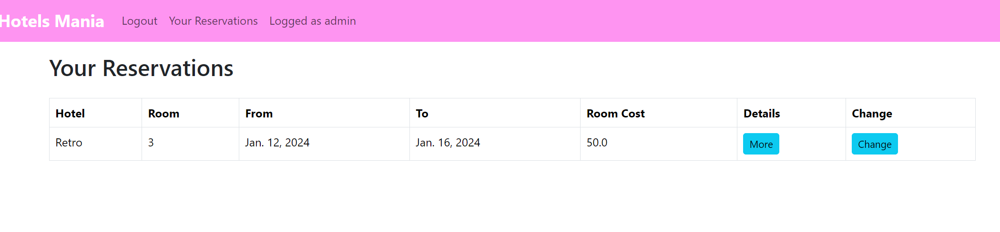

## Бронирование помещений 

Для того, чтобы забронировать комнату, необходимо нажать на кнопку "Reserve room" на странице [отеля](hotels.md). 
Появится поле с вводом номера комнаты и выбором даты начала и даты конца брони комнаты.

## Список бронирований

У каждого залогиненного пользователя есть вкладка "Your reservations", которая отображает все его брони. 

## Изменение брони
Из своего профиля по клику на бронь можно изменить её данные. 

### Удаление брони

Оттуда же, из профиля, можно удалить бронь через страницу изменения. При первом нажатии кнопки выскочит предупреждение.

