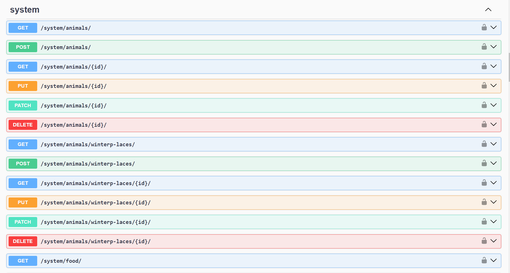
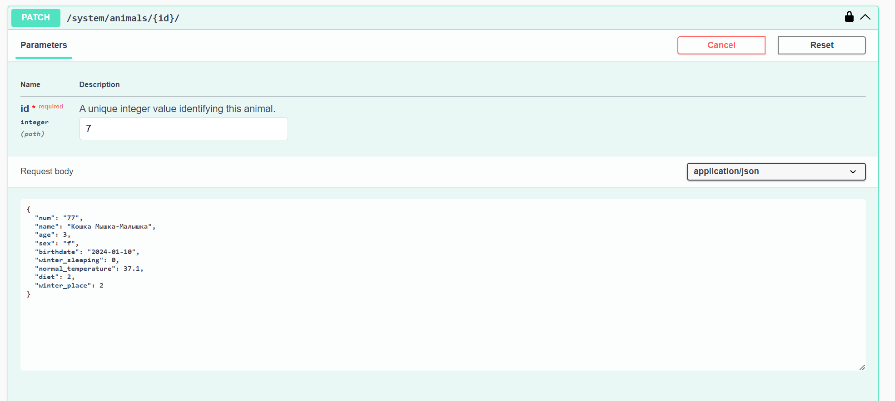

## Вид запросов в Swagger 

В ходе выполнения работы был реализован весь список необходимых запросов с использованием swagger и djoser. Таким образом, мы получаем такую картину по запросу ''' http://localhost:8000/api/swagger/ ''': 

Попробуем провести GET-запрос на животных: 

*Сразу получаем нужный результат - список из всех наших животных*

Затем попробуем добавить животное через POST-запрос: 

Получаем следующий результат: 

 
*Успешно добавили животного*

Последним попробуем PATCH-запрос на нашем новом животном: 

Проверяем, что всё получилось: 

*Ура, всё успешно!*