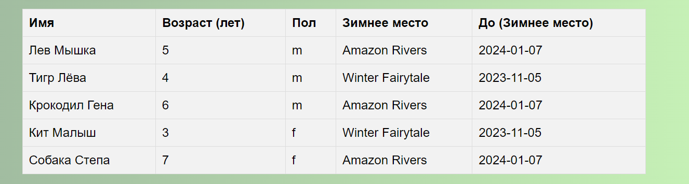

## Страница с животными

На данной странице представлена таблица животных, которые находятся в зоопарке. В качестве работы с объединением таблиц животные были объединены с таблицей зимних мест, где они проживают - оттуда мы достали срок, до которого животные живут там. 

## Поиск животного 
Также на странице реализована строка поиска животных, которая отфильтрует таблицу по заданному условию (буква\слово) в названии (имени) животного.

## Добавление животного 

На этой же страницы можно добавить животного в таблицу с помощью простой формы. 

